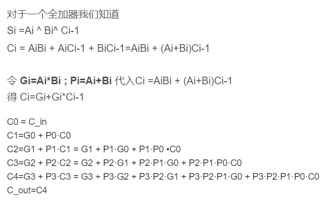
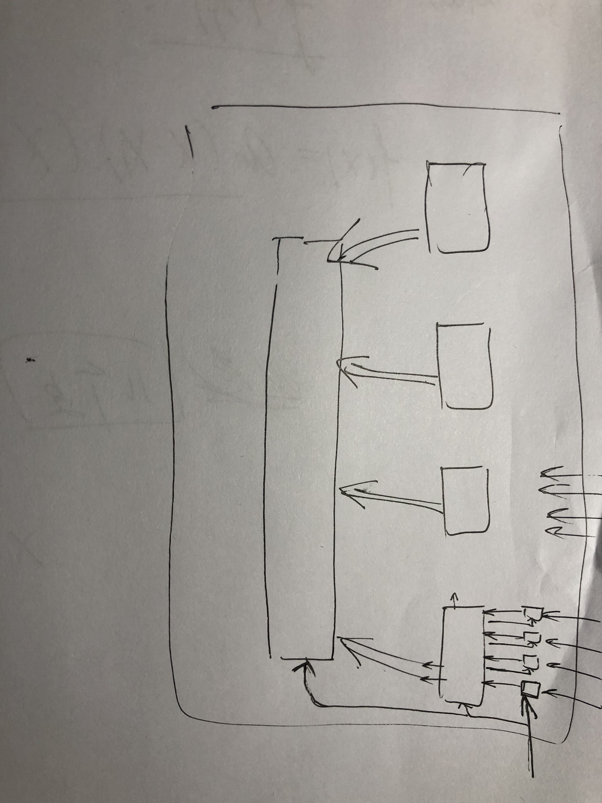

# Adder
Implement a 16-bit carry-lookahead adder using Vivado. 

## Realization
Compute carries for 4 full-adder using Carry-lookahead-unit in fewer gates latent. 

1-bit-full-adder: 
1. input: operands, carry(computed later). 
2. input: sum(result), P & G(info to CLU). 

4-CLU: 
1. input: Ps & Gs(info from 4 adders), C0. 
2. output: C1 & C2 & C3(give back to adders), C4(output), PP & GG(info for larger CLU). 

16-CLU: 
1. input: Ps & Gs(info from 4 4-CLUs), C0(Cout from 1st 4-CLU). 
2. output: C1 & C2 & C3(give back to CLUs). 

Modification: set the initial carry in 16(largest)-bit-CLU. And always assign C[0] = Cin. Hence the initial carry in the first full-adder is 0. 